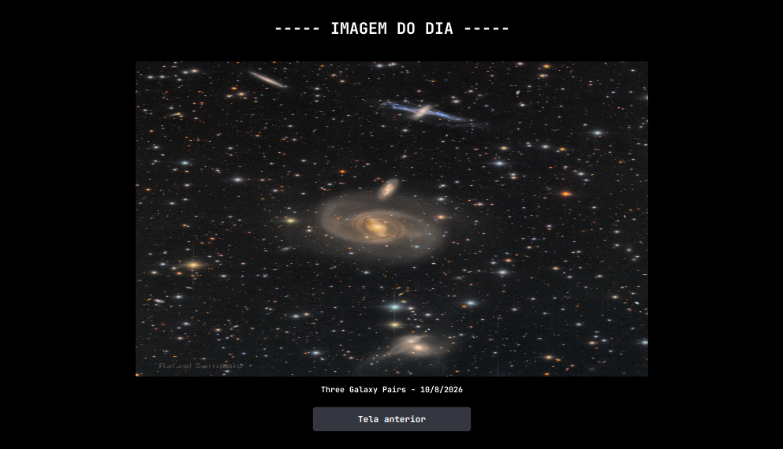
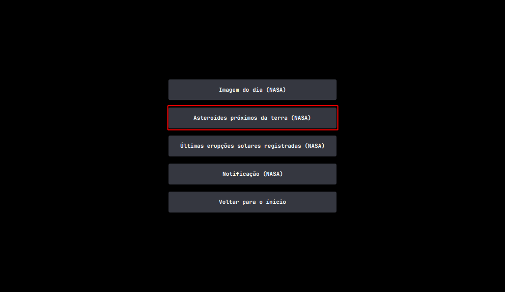
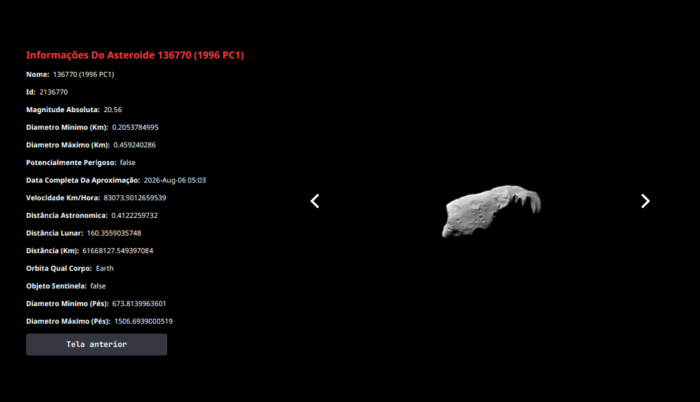
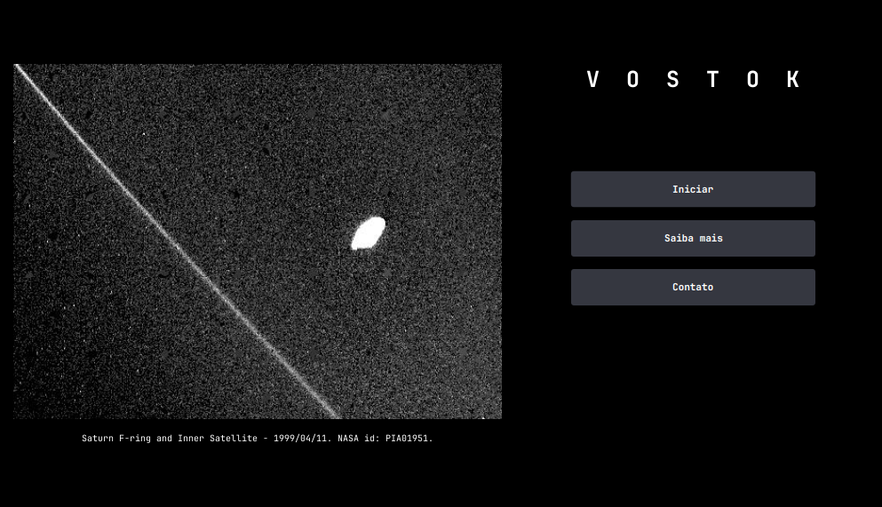
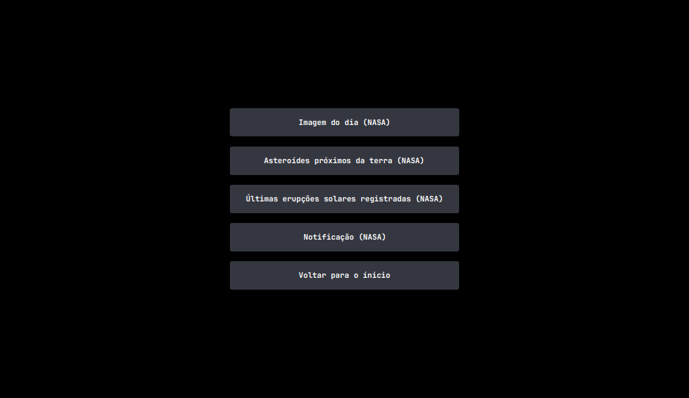
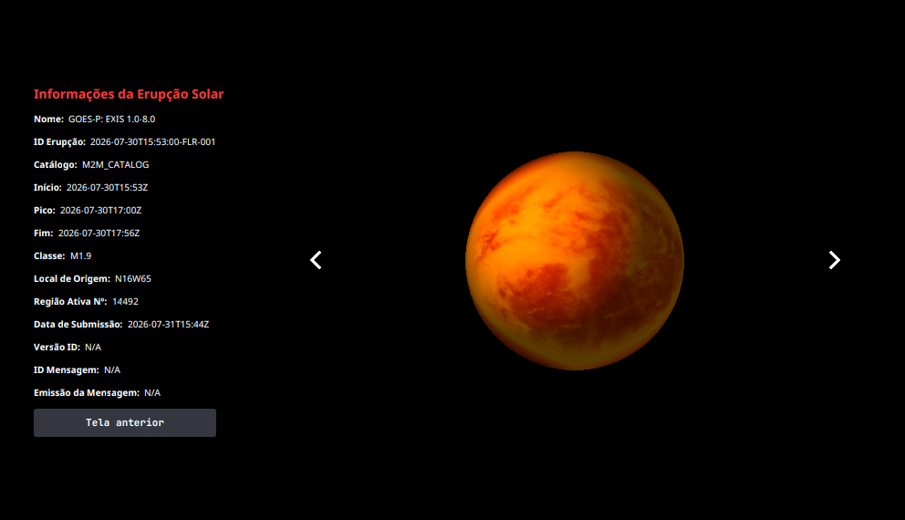
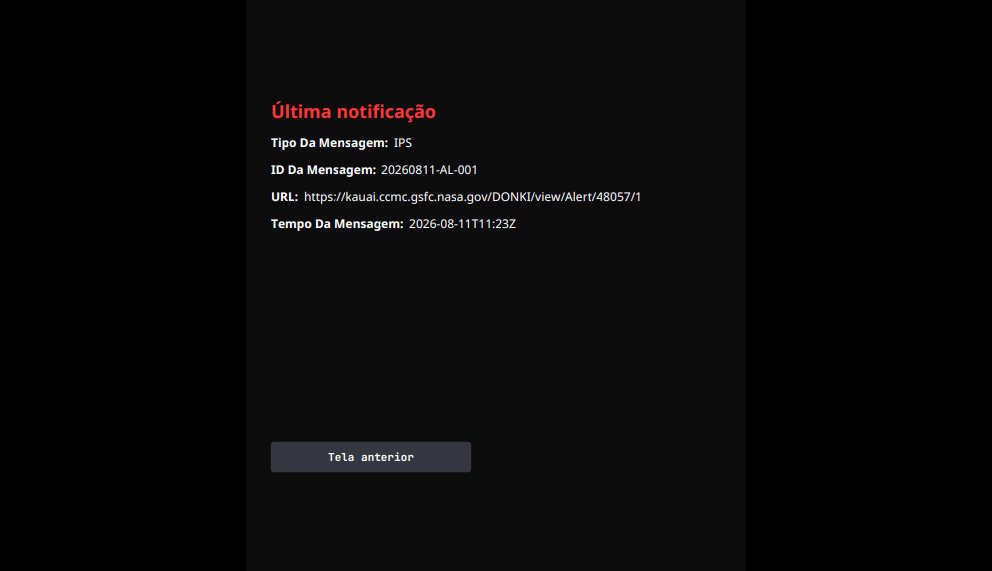
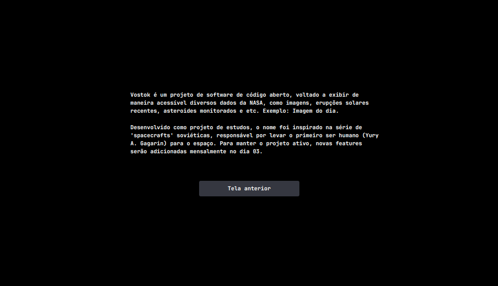
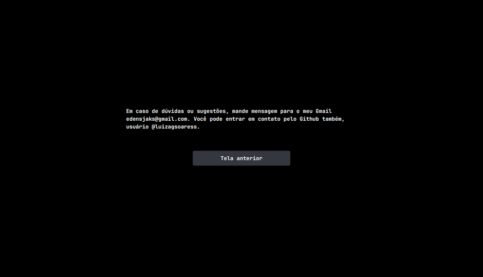

# Vostok

## Sobre

**Vostok** é um projeto de software de código aberto, voltado a exibir de maneira acessível diversos dados da NASA, como imagens, erupções solares recentes, asteroides monitorados, etc.

Desenvolvido como projeto de estudos, o nome foi inspirado na série de 'spacecrafts' soviéticas, responsável por levar o primeiro ser humano (Yury A. Gagarin) para o espaço. Novas features serão adicionadas mensalmente, permitindo a visualização de novos conteúdos.

**Exemplo**: Imagem do dia (2026-08-12)



## Como usar?

Para executar o programa, siga as seguintes instruções:

```bash
# Clone o repositório
git clone https://github.com/luizagsoaress/Vostok.git

# Entre na pasta do projeto e na subpasta que contém o pom.xml
cd Vostok
cd vostok

# Rode o código usando Maven:
mvn clean package && mvn compile && mvn javafx:run
```

## Exemplo

Veja os asteroides que se aproximaram da terra recentemente:



Clique na seta `>` para ver o próximo asteroide, ou na `<` para visualizar o anterior.



## Telas

<table>
  <tr>
    <td></td>
    <td></td>
  </tr>
  <tr>
    <td></td>
    <td></td>
  </tr>
  <tr>
    <td></td>
    <td></td>
  </tr>
  <tr>
    <td></td>
    <td></td>
  </tr>
</table>
